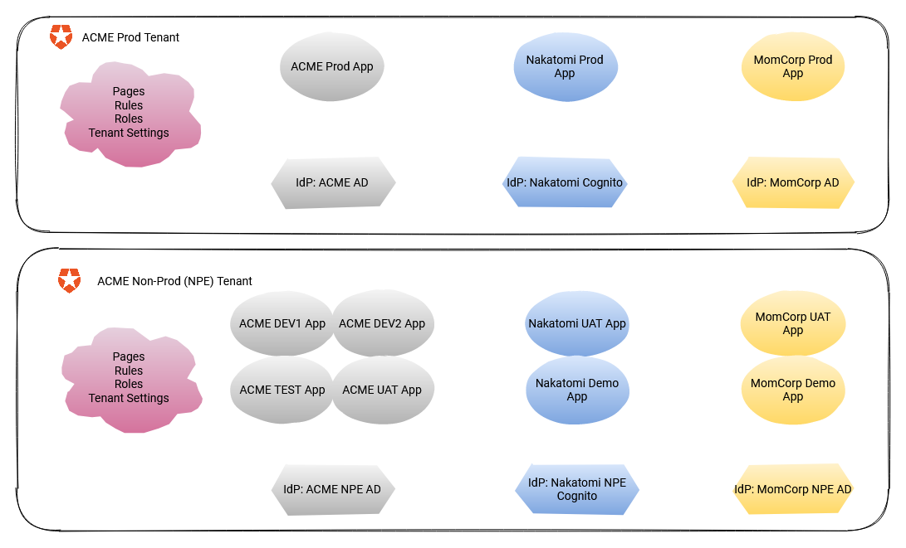

# Banjo Example Templates

This directory contains a variety of templates and overrides files that show some of what's possible with Banjo.

They show one possible way you can structure a set of templates for managing the Auth0 resources associated with multiple instances of an application, for example, PROD, UAT, TEST, DEV, etc.

In Auth0, some resource types apply to the entire tenant, while others apply to a specific application. This set of templates separates the templates for different resource types so that the Auth0 resources are in effect 'scoped' to a hierarchy.

## Tenant
Auth0 resources that apply to the whole tenant go here. If you deploy these templates every application that uses the Auth0 tenant will get the changes.

* Pages
* Roles
* Rules
* Tenant Settings

`./Tenant/Overrides` contains the overrides files for a production and non-production tenant.

## Customer
An organisation managing environments for multiple customers would only have one federated identity connection per customer that would be used by all the application instances managed for that customer.

* Connections

`./Customer/Overrides` contains the overrides fiels for production and non-production instances of the ACME, MomCorp, and Nakatomi IdP connection resources.

## Environment
Represents the application instance(s) for each environment, for example, PROD, UAT, TEST, DEV. These templates are deployed for every application environment that uses the Auth tenant.

* Clients
* Grants
* Resource Servers

`./Environment/Overrides` contains the overrides files for production, test, uat, and localhost instances of the clients, grants, and resource servers for the ACME customer.

## All Together Now
The Tenant/Customer/Environment logical scopes don't make sense for every organisation, so if that's you, then the `./AllTogetherNow` directory has all the same templates, just in the one directory.

`./AllTogetherNow` only contains the template files; you can use the `Tenant`, `Customer`, and `Environment` overrides files as inspiration to create your own overrides file.
